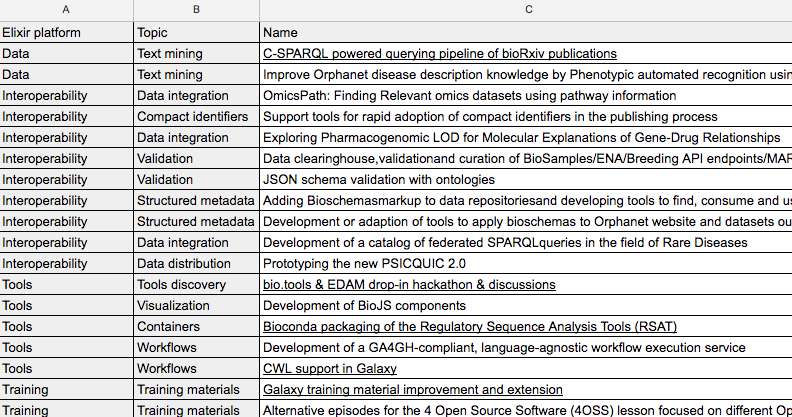
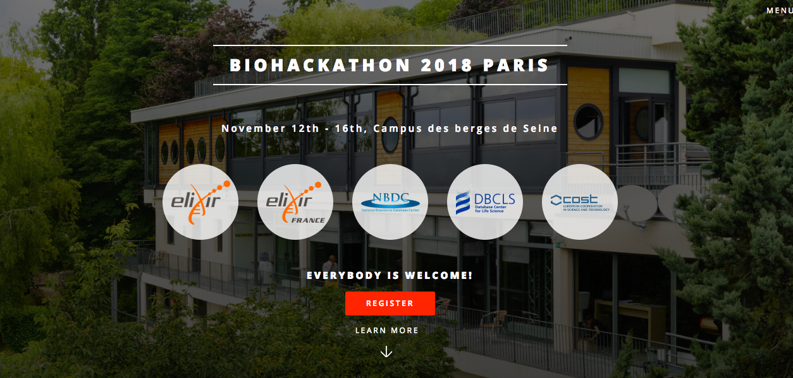

% Elixir Biohackathon
% [BH2018paris.info](https://BH2018paris.info)
% Victoria Dominguez Del Angel, AHM 2018!

## Reasons for organising a BH

<ul>
<li class="fragment">Hackathons have a good strategy to build bridges over traditional
research teams</li>
<li class="fragment">the out of the box ideas are potentially
accelerated thanks to the multidisciplinary teams and  stimulate the
environment</li>
</ul>

## ..and also

*  Different levels of expertise to assess the ideas of opening up research insights
*  Potentially a great agile extension to the more structured
collaboration between multiple investigators and institutions

## BH's aims

*  Elixir Hackathon wants to encourage developers to collaborate and develop solutions, ideas, simple and more complex codes 
*  During hacks participant should show practical implementations in
   Elixir communities and platforms during intensive and productive
   coding sessions
* Common challenges proposed by the sister BioHackathon organised in
Japan

## Propose and select hacking projects

*  Most of the topics should aligned to challenges proposed by ELIXIR
   platforms (data, tools, compute, interoperability and training),
   ELIXIR communities
* Advance the development of an open-source infrastructure for data
  integration to accelerate scientific innovation focusing on
  technology implementations of FAIR
* Strengthen the interactions between ELIXIR Platforms and Communities to establish and reinforce collaborations 

## WHAT WILL THE PARTICIPANTS GAIN ?

<ul>
<li class="fragment">Collaborative learning emerging from discussions with peers</li>
<li class="fragment">Testing EXISTING DEVELOPMENTS AND RESOURCES</li>
<li class="fragment">Improve Prototypes</li>
<li class="fragment">Sharing common interests that should bring people
together to organise or grow communities</li>
<li class="fragment">Reaching new users and improving awareness</li>
</ul>

## How to participate ?

* Propose a Hack Topic (deadline extended 11th June)
* Elixir Hackathon is free of charge and open to everyone
* Participants will manage their own transport and accommodation

## Overview

## Special Thanks

<ul>
<li class="fragment">Rafa, Dana and Sira for leading this event</li>
<li class="fragment">Toshiaki Katayama from DBCLS</li>
<li class="fragment">CHARME/ COST Action</li>
<li class="fragment">Interoperabilite platform members</li>
<li class="fragment">Committee members</li>
<li class="fragment">Ricardo for the beautiful website</li>
</ul>

##

What are you waiting for?

